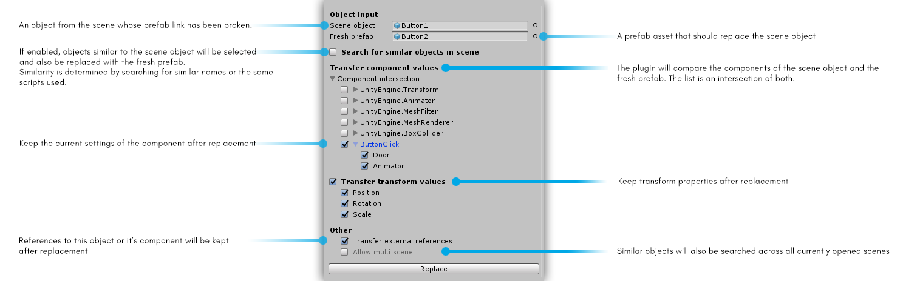
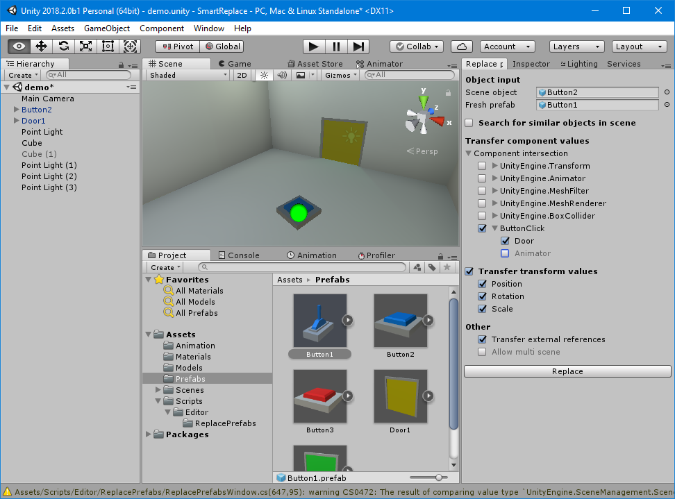
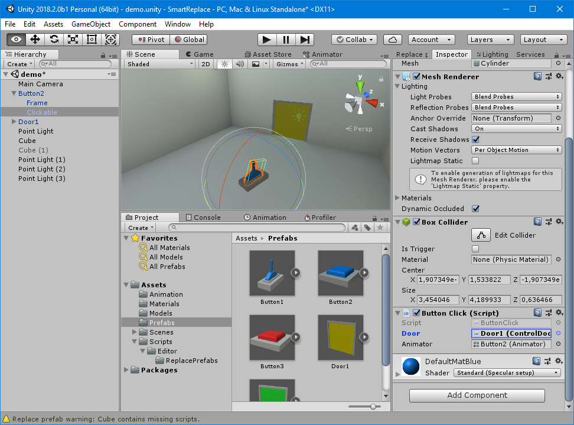

Smart replace is a Unity plug-in that helps you to restore broken prefab links. Besides from that, it can also replace prefabs in the scene with similar prefabs that contain the same scripts without losing any changes or object references.

# Requirements
In order to use the plugin the corrent .NET version is required to be set for your project. **Otherwise it will not compile**.
You can change the .NET version via: ```File -> Build settings -> Other settings -> Configuration -> Scripting Runtime Version -> .NET 4.x Equivalent```

## Setup
After downloading and installing the package you can open the Smart Replace window by navigating to ``Tools -> Replace prefab...`` .

## Usage
The following examples will show the main use cases of the plugin. [There is also a video  on youtube that explains the plugin more vividly.](https://www.youtube.com/watch?v=GBNcGWbXacQ)



### Restoring broken prefab links
In order to ``restore a prefab link`` of a scene object, first drag the scene object into the corresponding field of the window.
Next find the original prefab in the unity project window and drop it on the ``fresh prefab`` field.

Under ``Transfer component values`` you can select all components that may have changes you want to preserve.
Settings of unity components are currently not supported, with the exception of ``transform`` values.

After these settings were made, you can hit ``Replace`` and the prefab link will be restored without losing the changes you've made to your object in the scene.

### Replacement with similar objects
Often in game development, dummy prefabs are created to test a particular functionality of a game elememt. In the later stages of game development, a better version of this button will be created - with prettier models, textures, shaders and so on.

So if you have a level with only the dummy prefabs, but you want to replace all of them with your new, better version, Smart.Replace can help you.

The example images below show a scene with a button and a door. The button has a script called ``Button Click`` that contains a reference to the door object, so it can open or close the door when clicked.



There is also another button prefab, as you can see in the project view, called ``Button 1``. It looks a bit different, but also contains the ``ButtonClick`` component and can therefore be used like our current button. This is a good candidate for replacement, so we first drop our scene object into the Smart.Replace window, then the better button prefab, make sure that the door reference will be maintained after replacement and then we hit ``replace``.



The button has successfully been replaced and still has the reference to the door, so it still works!

Just like this, all settings of all components can be maintained during replacement, like ``integer`` values, ``colors``, ``strings`` and so on.

The ``Fresh prefab`` **does not** need to have the same object hierarchy as the ``scene object`` since Smart.Replace only cares for the intersection of components (see limitations for more info).

### Preserving external references

How about we replace the door now? This seems a bit tricky, since the door doesn't now it's referenced by the button.
However, Smart.Replace does, when you enable the option ``Transfer external references``.

The process is the same again. We first select the scene object and then the prefab.
Again we hit replace and the door will be replaced with another prefab. At the same time, the button's reference to the door will be updated.

Smart.Replace will search for external ``object`` and ``component`` references to the object being replaced. It will even search ``lists`` and ``arrays`` for possible references and will update them like described.

### Replacing multiple prefabs

If you have mutiple similar objects in the scene that you want to replace, it would be tedious to do it one by one.

Smart.Replace offers search for similar objects, so we can replace any number of objects at once.
First we select any of the objects in the scene and then a prefab - so we can search for similar objects.
By default there are no filters, so all objects in the scene are shown. Search by name is very efficient in cases where all objects have similar names.
You could also search for components.

If we now hit replace, we see that all objects are replaced at once. If they had references onto each other, they would have also been preserved.

## Limitations
In order to make the plug-in easy to use, it has some limitations you should know of:

1. Eventhough the ``component intersection`` shows unity components for the sake of completeness, their values can currently not be maintained. The only exception is the ``transform`` component that has it's own UI (see below).
2. The transfer of any component values are limited to ``one component type per object``. If you have multiple components of the same type on your scene object, only the first one's values will be maintained. The rest will be discarded.
3. External references to the replaced ``object`` will be maintained. However, external object references will always point to the ``parent`` object after replacement.

## Contact

You can contact me anytime at malte.weiss.assets@gmail.com.
